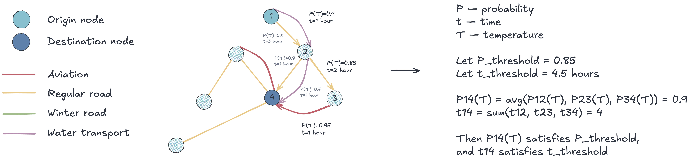
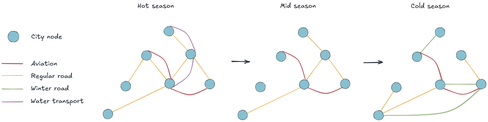
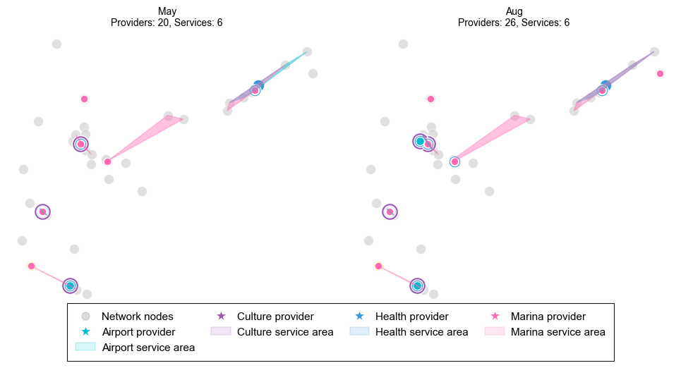
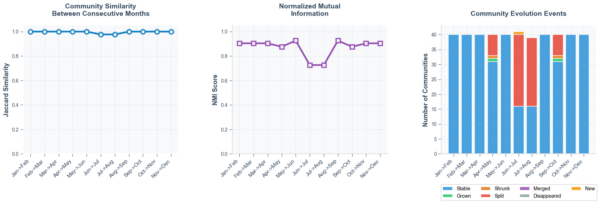

***

# SEASONAL MULTILAYER SERVICE NETWOKR: ❄️ ARCTIC


<table>
  <tr>
    <td>Multilayer network</td>
     <td>Scheme 1: Network overview</td>

  </tr>
  <tr>
    <td></td>
    <td></td>

  </tr>
 </table>

 <table>
  <tr>
    <td>Flows by transport type</td>
     <td>Scheme 2: Seasonal network evolution</td>
  </tr>
  <tr>
    <td></td>
    <td></td>

  </tr>
 </table>

  <table>
  <tr>
    <td>Sankey-like demand flow distribution</td>
  </tr>
  <tr>
    <td></td>

  </tr>
 </table>

  <table>
  <tr>
    <td>Temporal service areas evolution</td>
     <td>Temporal network service community evolutions</td>
  </tr>
  <tr>
    <td></td>
    <td></td>

  </tr>
 </table>


## Repository structure

```
├── data
│   ├── processed           <- Modified data
│   └── raw                 <- Original, immutable data
├── notebooks               <- Jupyter notebooks
├── plots                   <- Generated figures
├── scripts                 <- Scripts to execute
├── .gitignore              <- Files and folders ignored by git
├── .pre-commit-config.yaml <- Pre-commit hooks used
├── README.md
└── requirements.txt        <- Requirements file to set up the environment using pip
```